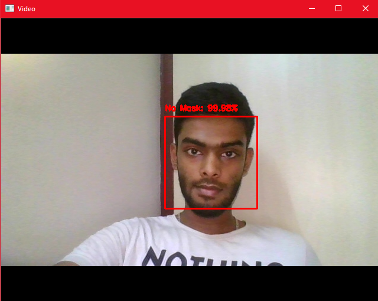
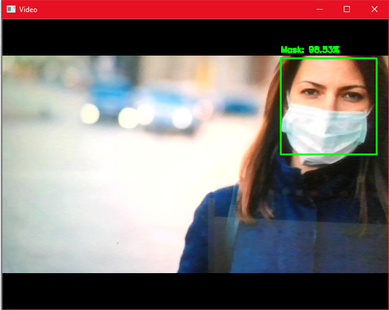

## mask_detection
## Major steps includes:
### 1.Image Extraction to collect data:
Check out my previous repo to the code for extactor
### 2.Training the model:
Model can be trained indigenously(natively coded, code included in prev. repo) or can be trained using teachable machine/Lobe
### 3.Predicting the result
main.py, where the model is used to predict whether a person is wearing a mask or not

### End Results:

